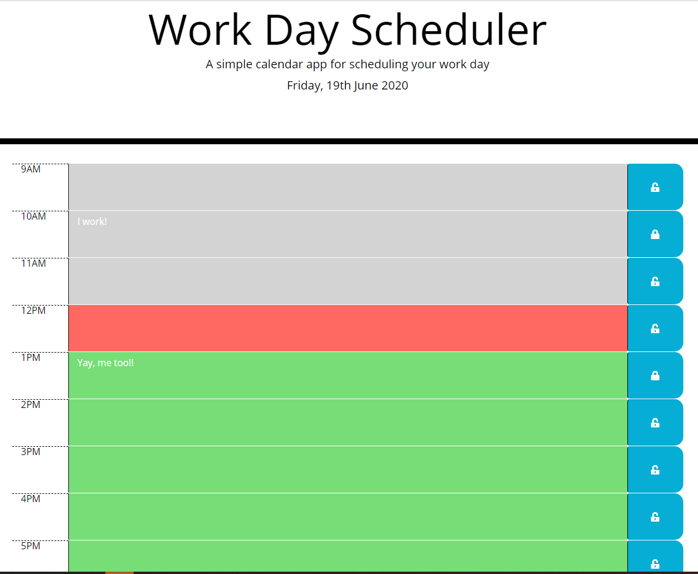

# Workday planner

A calendar application that allows the user to save events for each hour of the day.
The [live version can be demoed here](https://maria-helbling.github.io/dayplanner/).
And the application looks like this at midday:



## User Story

```
AS AN employee with a busy schedule
I WANT to add important events to a daily planner
SO THAT I can manage my time effectively
```

## Acceptance Criteria

```
GIVEN I am using a daily planner to create a schedule
WHEN I open the planner
THEN the current day is displayed at the top of the calendar
WHEN I scroll down
THEN I am presented with timeblocks for standard business hours
WHEN I view the timeblocks for that day
THEN each timeblock is color coded to indicate whether it is in the past, present, or future
WHEN I click into a timeblock
THEN I can enter an event
WHEN I click the save button for that timeblock
THEN the text for that event is saved in local storage
WHEN I refresh the page
THEN the saved events persist
```


## Build

* The site is built using Bootstrap.
   * The use of Bootstrap minimises the need for media queries for responsiveness.
   * See [Bootstrap documentation](https://getbootstrap.com/docs/4.5/getting-started/introduction/) for customising the site with their provided options
* FontAwesome is used for save key images. [Read more about fontAwesome use and installation here.](https://fontawesome.com/how-to-use/on-the-web/referencing-icons/basic-use)
* Date and time manipulation is done using [Moment.js](https://momentjs.com/).

### Future plans

-[ ] Add weather info
-[ ] Add public holidays info

## Setup

To clone the repo:
```
git clone https://github.com/maria-helbling/dayplanner.git
``` 

## Credits

The css design was provided by client.

## License

Built by Maria Helbling
This application is released under [MIT](LICENSE.txt) license.

## Contributing

To contribute to this application, create a pull request.
Here are the steps needed for doing that:
- Fork the repo
- Create a feature branch (git checkout -b NAME-HERE)
- Commit your new feature (git commit -m 'Add some feature')
- Push your branch (git push)
- Create a new Pull Request

Following a code review, your feature will be merged.
